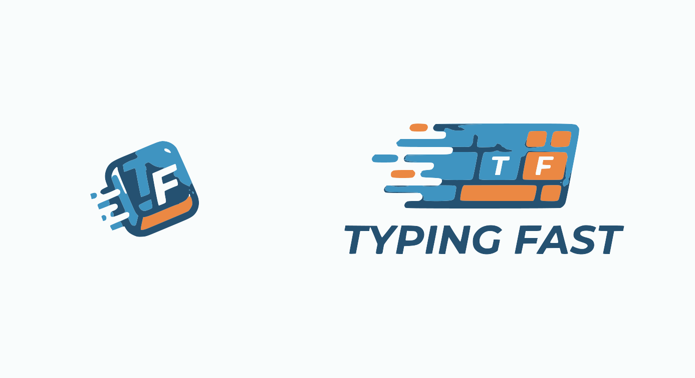
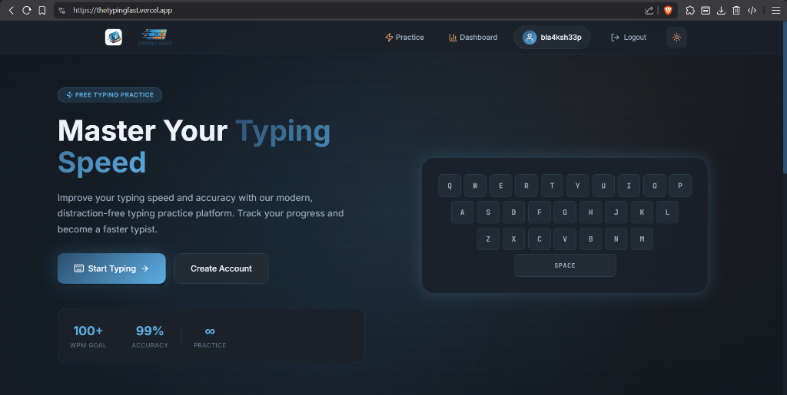
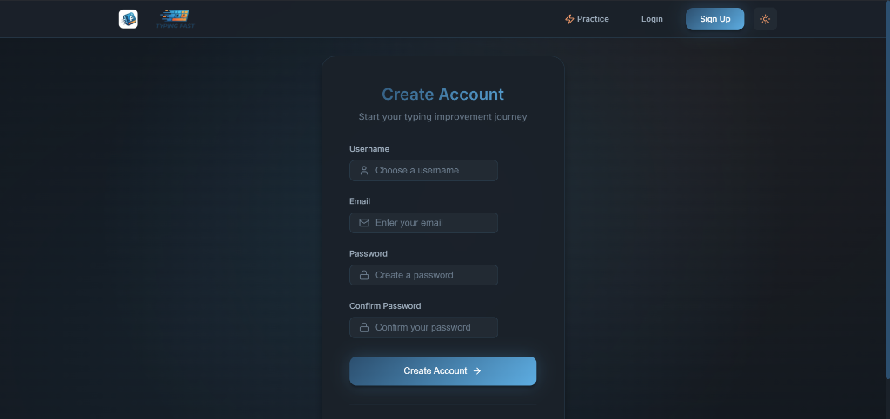
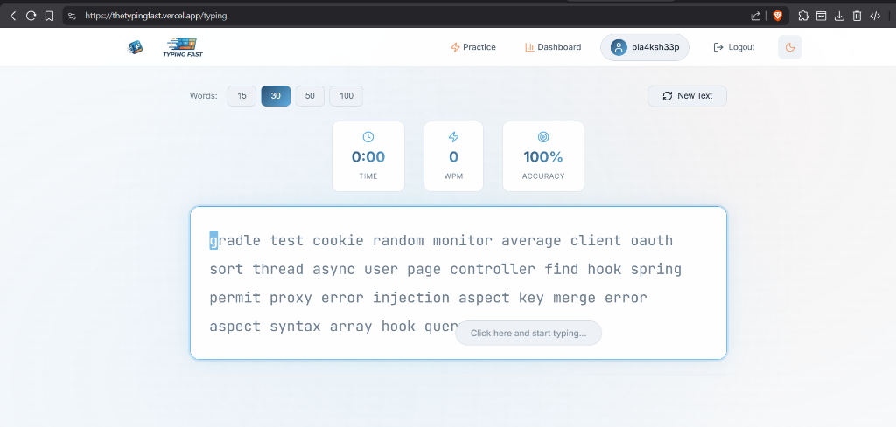
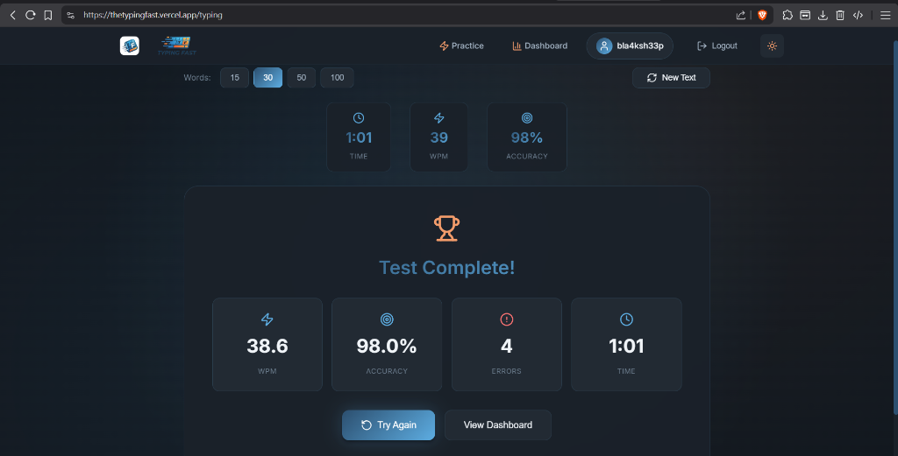
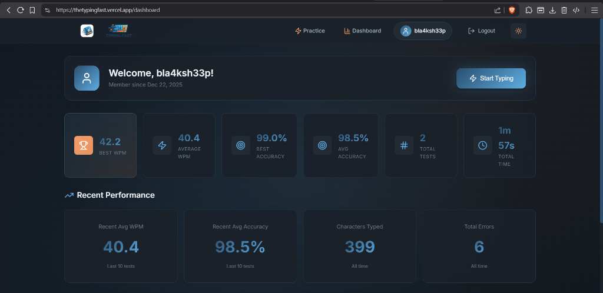
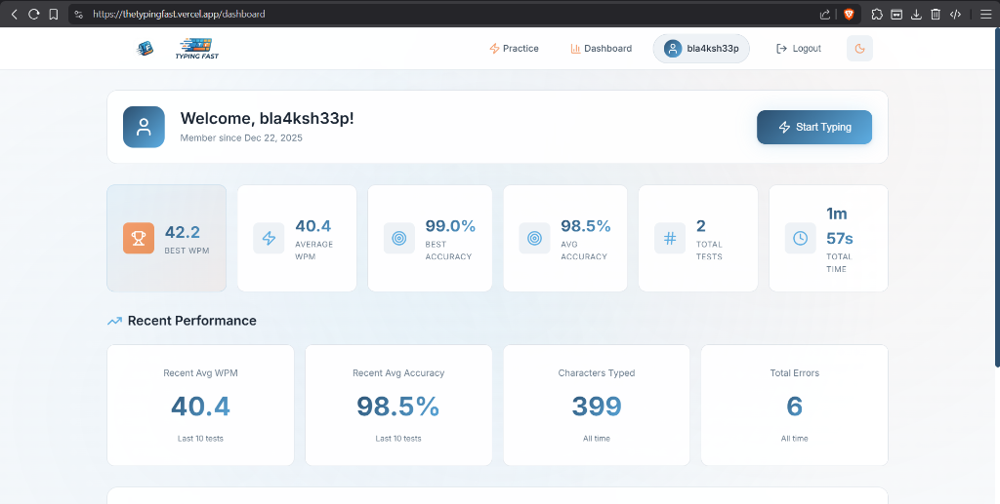

<p align="center">
  
</p>

<p align="center">
  
  
  
  
  
  
</p>

<h1 align="center">TypingFast</h1>

<p align="center">
  <strong>Master Your Typing Speed</strong><br/>
  A modern, distraction-free typing practice platform to improve your typing speed and accuracy.
</p>

<p align="center">
  <a href="https://thetypingfast.vercel.app">
    
  </a>
</p>

<p align="center">
  
  
</p>

---

##  Screenshots

###  Landing Page
A clean, modern landing page with an interactive keyboard animation to get you started.

<p align="center">
  
</p>

###  Sign Up
Create an account to track your progress and compete with others.

<p align="center">
  
</p>

###  Typing Practice
Practice with customizable word counts (15, 30, 50, or 100 words) and track your WPM, accuracy, and time in real-time.

<p align="center">
  
</p>

###  Test Complete
Get detailed results after each test with WPM, accuracy, errors, and time taken.

<p align="center">
  
</p>

###  Dashboard (Dark Mode)
View your comprehensive statistics including Best WPM, Average WPM, Accuracy, Total Tests, and Recent Performance.

<p align="center">
  
</p>

###  Dashboard (Light Mode)
The same powerful dashboard with a clean light theme.

<p align="center">
  
</p>

---

##  Features

-  **Real-time Typing Tests** - Practice with randomly generated text
-  **Performance Tracking** - Track your WPM, accuracy, and errors
-  **Personal Dashboard** - View your progress and statistics over time
-  **User Authentication** - Secure login/signup with JWT
-  **Dark/Light Mode** - Toggle between themes for comfortable typing
-  **Responsive Design** - Works seamlessly on desktop and mobile
-  **Customizable Tests** - Choose between 15, 30, 50, or 100 words

---

## 🛠 Tech Stack

### Backend
| Technology | Description |
|------------|-------------|
|  | Java-based backend framework |
|  | Relational database for storing user data |
|  | Secure authentication tokens |

### Frontend
| Technology | Description |
|------------|-------------|
|  | Modern JavaScript UI library |
|  | Type-safe JavaScript |
|  | Fast build tool and dev server |

### DevOps & Deployment
| Technology | Description |
|------------|-------------|
|  | Containerization for consistent environments |
|  | Frontend hosting platform |
|  | Backend & database hosting |
|  | Version control & collaboration |

---

##  Getting Started

### Prerequisites

- **Java 17+** - [Download](https://adoptium.net/)
- **Node.js 18+** - [Download](https://nodejs.org/)
- **Docker** (optional) - [Download](https://docker.com/)
- **MySQL** - [Download](https://mysql.com/)

###  Quick Start with Docker

```bash
# Clone the repository
git clone https://github.com/StrongBunny07/TypingFast.git
cd TypingFast

# Start all services
docker-compose up -d
```

The application will be available at:
- Frontend: `http://localhost:5173`
- Backend: `http://localhost:8080`

###  Manual Setup

#### Backend Setup

```bash
# Navigate to project root
cd TypingFast

# Build the project
./mvnw clean install

# Run the application
./mvnw spring-boot:run
```

#### Frontend Setup

```bash
# Navigate to frontend directory
cd frontend

# Install dependencies
npm install

# Start development server
npm run dev
```

###  Environment Variables

Create a `.env` file in the root directory:

```env
# Database Configuration
SPRING_DATASOURCE_URL=jdbc:mysql://localhost:3306/typingfast
SPRING_DATASOURCE_USERNAME=your_username
SPRING_DATASOURCE_PASSWORD=your_password

# JWT Configuration
JWT_SECRET=your_super_secret_key
```

---

##  Contributing

We love contributions! TypingFast is **open source** and we welcome developers of all skill levels to help make it better.

### How to Contribute

1. **🍴 Fork the Repository**
   ```bash
   git clone https://github.com/YOUR_USERNAME/TypingFast.git
   ```

2. **🌿 Create a Feature Branch**
   ```bash
   git checkout -b feature/amazing-feature
   ```

3. **💻 Make Your Changes**
   - Write clean, documented code
   - Follow existing code style
   - Add tests if applicable

4. **✅ Commit Your Changes**
   ```bash
   git commit -m "feat: add amazing feature"
   ```

5. **📤 Push to Your Fork**
   ```bash
   git push origin feature/amazing-feature
   ```

6. **🔀 Open a Pull Request**
   - Go to the original repository
   - Click "New Pull Request"
   - Select your fork and branch
   - Describe your changes


<p align="center">
  <strong>Star this repo if you find it helpful!</strong>
</p>

<p align="center">
  Made with ❤️ by <a href="https://github.com/StrongBunny07">StrongBunny07</a>
</p>

<p align="center">
  <a href="https://github.com/StrongBunny07/TypingFast/issues">Report Bug</a> •
  <a href="https://github.com/StrongBunny07/TypingFast/issues">Request Feature</a>
</p>
